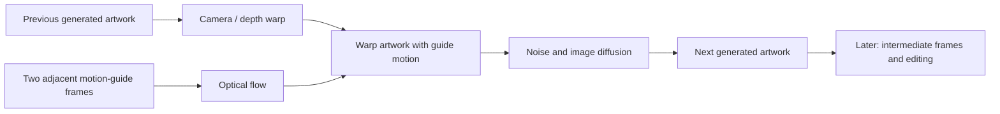

# The BonsAi Effect: Deforum workflow study

Research date: **2026-09-07**. The supplied channel was not already in the reference collection; *Brain Entity* is by a different creator. The new references are [Frustration and Intoxication](../../apps/deforum/projects/reference-studies/references/bonsai-frustration-and-intoxication.md) and [SDXL motion-preset examples](../../apps/deforum/projects/reference-studies/references/bonsai-motion-presets.md).

**Main finding:** the artist's work combines a chosen visual language, controlled image evolution, several ways to drive motion, and substantial editing. The July preset demonstration gives us an unusually concrete reference: source settings, named model overrides and downloadable motion guides. It does not reveal the January film's exact recipe.

The next useful experiment is a short reproduction of **Evolve Zoom Slow**, the chapter at Olof's 9:25 link. Preserve P3 + RIFE as our creative control, first establish the reference mechanism, then test a purposeful camera reveal. A new model remains a separate audition; these liked examples show that SDXL can support the target quality, not that it is the best available model or that any one component explains the result.

## Evidence and coverage

| Evidence type | Reviewed or preserved | Limit |
| --- | --- | --- |
| Public channel metadata | All **124 available uploads**, including titles, dates and descriptions, collected through the YouTube Data API. Older Deforum descriptions were read selectively. | Not 124 watched videos. Current channel marketing includes newer tools and must not be projected backward onto 2024 work. |
| Public discussion | Complete pagination for **29 selected videos: 1,000 top-level comments and 1,378 replies**. Creator identity checked by channel ID. Relevant technical threads were read; 57 keyword-selected creator comments saved separately. | Retrieval completeness is for those available threads at fetch time, not deleted/private comments. Keyword filtering may miss other useful discussion. |
| First supplied video | 24 whole-film samples, 16 one-second transition samples, and 20 detailed selections including an every-frame window. All eight pages inspected. | Sampled-frame review, not complete real-time audiovisual viewing. |
| Second supplied video | One image from each of 47 chapters, plus 26 selections around 9:25, including all 13 frames at 565–565.4s. All ten pages inspected. | Only the selected chapter received dense temporal review. The other chapters were not all motion-ranked. |
| Preset author tutorial | Downloaded captions for the linked [Purz / Safety Marc session](https://www.youtube.com/watch?v=kE4GtMN9KCQ), published 2024-04-27. Searched the first 75 minutes; closely read selected passages at 7:00–12:40, 22:20–23:20, 30:00–32:10 and 40:35–42:20. | Automatic captions, including transcription errors; not a full viewing of the 3h18m session or its later Reforum demonstration. |
| Preset source | **95 settings files plus README**, pinned to `bb8ce2fb0fd693319087460c8b21c13e19864be5` (2024-04-22). Seven relevant presets inspected closely. | Source inspection, not successful import/execution in our worker. |
| Guide media | Original 86 MB hybrid-video ZIP, integrity checked; circle-zoom and turbulent-noise videos extracted and visually sampled. | Current downloadable archive; no historical archive hash from the artist's 2024 run. |
| Other platforms | [Verified Substack and Facebook, with external-source notes](bonsai-effect-external-sources.md). | No accessible external historical settings guide or technical interview found. |

Local originals, raw metadata, comments, captions, preset copies and review manifests are under [reference assets](../../apps/deforum/projects/reference-studies/references/assets/artist-channel-2026-09-07/), ignored by Git. [Acquisition index](../../apps/deforum/projects/reference-studies/references/assets/artist-channel-2026-09-07/study-manifest.json). Research notes and links are tracked. No GPU resources, model installations or rendering jobs were used for this study.

## What the artist reports across older videos

These are dated statements about particular projects, not universal settings. Creator-comment links target the reply; the public platform may require expanding its thread.

| Source | Creator-reported method | Practical implication |
| --- | --- | --- |
| [First SDXL Deforum attempt, 2023-09-12](https://www.youtube.com/watch?v=7rgZuRi0tFQ), [Worlds II, 2023-09-16](https://www.youtube.com/watch?v=rkRo4LEmLwE) | Text prompts and motion; explicitly no ControlNet or source-video/image guidance. Favors simple descriptive prompts over lengthy SD1.5-style prompting. | Strong work can start from plain image feedback. Do not attribute every good result to hidden ControlNet or input footage. |
| [Time Travel, 2023-11-05](https://www.youtube.com/watch?v=s0_cgVW8P9I), [Coldness of Time, 2023-11-25](https://www.youtube.com/watch?v=W20e2XiQBqE) | Deforumation for live prompt and camera steering. | The artist can react to emerging pictures rather than commit every choice before generation. |
| [Time, 2024-01-04](https://www.youtube.com/watch?v=S0SGTuZj8OM) | Parseq uses the song's bass to synchronize part of the image sequence; Premiere Pro editing and Topaz finishing. | Separate musical control curves from editorial timing and final enhancement. |
| [Hello Again, creator reply](https://www.youtube.com/watch?v=1uISXcgIW-c&lc=UgzamINgJS-K4MmBKEJ4AaABAg.A-ADIwRVM5KA-AWekSXez8) | Suggests holding an iterating seed for 3 or 5 frames, alongside higher cadence. Qualifies this as experience rather than a proven explanation, and reports a Parseq caveat. | A held seed is an untested middle ground in our pipeline; numerical seed increments are not gradual noise interpolation. |
| [Spirit of Adventure, 2024-03-11](https://www.youtube.com/watch?v=FTTpXcHUNMo) | Forge, SDXL, Deforum, Parseq; cadence 3, CFG 6, 15 FPS timeline; Topaz to 4K/60 FPS. | Generation timeline, diffusion cadence and delivery FPS are three different settings. |
| [Psychedelic Journey, 2024-03-10](https://www.youtube.com/watch?v=8ynx-Em9QrE), [White Fox, 2024-03-30](https://www.youtube.com/watch?v=Kg5-At3fz54) | A subtle FrameSync strength schedule from music/percussion; cadence 3, CFG 6, 15 FPS, later editing and Topaz finishing. | Small repaint-strength variation can be an artistic control without turning every beat into an abrupt replacement. This is the artist's assessment, not our measured ablation. |
| [Us and Them, live-steering reply](https://www.youtube.com/watch?v=ROr8NVHoUaI&lc=UgyZHXCWdFenfjvOpqR4AaABAg.A1E4REcmzU2A1EuWA7rhLW) | Deforumation QT replay, rewind and changes to prompt, camera, strength, cadence and LoRAs during work. | Direct precedent for Olof's desired inspect/change/restart filmmaking loop. |
| [Meow, 2024-05-01](https://www.youtube.com/watch?v=XkF5x3qfFqg) | Percussion-derived strength from FrameSync, cadence 1, CFG 7, 15 FPS; edited and finished at 4K/60. | Cadence 3 or 5 is not a channel-wide rule. |
| [Love in a Can, 2024-05-04](https://www.youtube.com/watch?v=uXQsh_D4LTs) | ComfyUI SD1.5 AnimateDiff pieces, edited together, then SDXL video-to-video with DynavisionXL/LoRAs and Topaz. | The artist also experiments with guided redraw. This recipe is distinct from the two supplied films. |
| [Float, detailed creator reply](https://www.youtube.com/watch?v=CvlCY8-QkJM&lc=UgxJNzBAmNSJx-HAk894AaABAg.A6TkV6-UcUcA6TtFv2arr7) | Prompt every 150 frames, 15 FPS, cadence 5, seed changes every 5 frames, strength 0.8, default noise, Cheyenne SDXL, 3D, After Effects camera export via AE2SD; later Topaz 60 FPS/4K. | About 10 seconds between prompt waypoints on the stated timeline. Motion can be authored outside Deforum. The numeric strength requires translation before comparison with ComfyUI. |
| [Ocean of Dreams, creator reply](https://www.youtube.com/watch?v=Hks_yeSyzP4&lc=Ugy9xU55rREt8jJpjZh4AaABAg.A6utB63A5tcA6waWxGDQ0N), [Time Lords, creator reply](https://www.youtube.com/watch?v=8sooaXNodxA&lc=UgzsNGmRUyOAGLfPSch4AaABAg.A7d4cbkJDweA7dGPAsxn_H) | Respectively cadence 5/strength 0.7, and cadence 3/40 steps compared with the artist's usual maximum around 25. | They vary the recipe by artwork and intent. These comments do not establish modern hardware performance or optimal step counts. |

Historical comments about Forge/ControlNet/Parseq compatibility describe the artist's environment at that time. They are not current incompatibility claims. Likewise, reported multi-hour runtimes are not cost or speed predictions for our serverless worker.

## Their editing process is especially relevant

For [Comfortably Numb](https://www.youtube.com/watch?v=hOo-Hyxcy1o), the artist repeatedly describes generating many short clips and choosing the ones that suit their interpretation of the music. They report a much larger pool than the roughly 20 clips ultimately used, with speed changes and rejected attempts. Later replies give rough estimates of five days to about a week, not a timed production log. [Clip selection](https://www.youtube.com/watch?v=hOo-Hyxcy1o&lc=UgzFwVcMkjX5f-DF0DN4AaABAg.AFaf9koI1jYAFawe9VMbR5), [five-day account and speed changes](https://www.youtube.com/watch?v=vmKePs6iHs4&lc=Ugw5RwK5bUaw9bS1fFB4AaABAg.A8mW2ODkYngA8mrdm1R9Wo).

A particularly useful reply describes selecting starting images, generating individual clips, redoing sections during editing, increasing 15 FPS material to 60 FPS before the final edit, and upscaling the finished result to 4K. This is their reported process for that film, not proof of the exact export sequence for the January reference. [Detailed process reply](https://www.youtube.com/watch?v=hOo-Hyxcy1o&lc=UgzVH44KL_vZSSDrzeV4AaABAg.A9u12mMfDE9A9uu-iF-uN7).

Our implication: preserve generations, curate deliberately, and make small continuations. A polished film can reflect extensive selection and retiming in addition to a good renderer. Keep raw and finished clips available so interpolation does not hide the behavior being tested.

## How the motion presets actually work

The [preset author](https://github.com/S4f3tyMarc/Deforum-Studio-Presets) targets the Automatic1111/Forge Deforum extension and explicitly excludes notebook/Comfy-node import. Most presets require their accompanying hybrid input video; the Classic family does not. The README recommends Protovision XL and lists tested resolutions. The BonsAi Effect substitutes Cheyenne and Illusionix in the July demonstration; exact checkpoint/LoRA file hashes and plugin versions are not supplied.

The key distinction is **hybrid motion versus hybrid compositing**. In the inspected Evolve presets, optical flow measures movement between input-guide frames. That flow then deforms the previous generated image before diffusion. `hybrid_composite = None` means the guide's pixels are not directly mixed into the generated image by that compositing stage. This is not our post-render Flow Stabilize operation, and it is not RIFE. [Pinned renderer, warp stage](https://github.com/deforum/sd-webui-deforum/blob/5d63a339dbec8d476657a1f672a4eeb6dc79ed37/scripts/deforum_helpers/render.py#L410-L440), [preset-author explanation around 11:00](https://www.youtube.com/watch?v=kE4GtMN9KCQ&t=660s).

The archived circle guide shows one expanding white ring on black. The turbulent-noise guide shows evolving, roughly symmetrical grayscale blobs. They are simple ways to move pixels; neither is a 3D reconstruction or a guarantee of correct object motion. The creator's source videos are preserved and sampled in the [reference review](../../apps/deforum/projects/reference-studies/references/bonsai-motion-presets.md).

In plain language, the ring is a **motion reference**. Compare two neighboring guide frames, estimate where their pixels moved, apply those movements to the previous artwork, then ask the image model to repaint that warped artwork. The picture can still depict a face, a building or a landscape: the white ring is not pasted over it. Optical flow estimates local displacement; a sparse ring does not specify perfect radial movement at every pixel.

Evolve Zoom Slow also moves a depth-based camera forward, with small horizontal and vertical offsets. Its name describes the visible approach, not a purely 2D implementation. Camera warping and guide deformation both happen before repainting. RIFE instead creates intermediate frames afterward. A depth-based camera uses an estimated near/far arrangement from an image; it does not give us a complete 3D scene with known hidden surfaces.

### Settings that matter for the linked chapter

[Evolve-Zoom-Slow-30s, pinned file](https://github.com/S4f3tyMarc/Deforum-Studio-Presets/blob/bb8ce2fb0fd693319087460c8b21c13e19864be5/Deforum-Presets/Evolve-Zoom-Slow-30s.txt). These are the downloadable author's settings, not an exact runtime export from The BonsAi Effect.

| Control | Downloaded preset | Comparison with our current recipe |
| --- | --- | --- |
| Sampling | DPM++ 2M SDE Karras; 18 steps; CFG 4 | P3 uses a different sampler variant, 30 steps and CFG 4.5. Equal step counts across backends need not mean equal executed sampling work. |
| Timeline | 12 FPS, 362 frames, cadence 1 | P3 has 8 source FPS and cadence 1. Retiming must include camera/noise/prompt schedules and transport/export code. |
| Seed | Fixed main seed; subseed 2; **constant blend strength 0.3** | P3 increments the seed each frame. Our fixed-seed C01/C03 tests did not test this complete combination. |
| Image retention | Strength schedule around 0.40–0.42 | The inspected WebUI adapter converts this to denoise around **0.60–0.58**. P3's direct ComfyUI denoise is 0.82. |
| Other noise/color | Image noise 0.035, noise multiplier 1.01, LAB coherence | Similar labels do not establish identical operations, scaling or schedules. |
| Camera | 3D, depth warping with MiDaS, forward translation 1.8 plus small X/Y offsets | P3 uses a tiny 2D zoom. Our separate 3D loop reuses its starting depth. Translation units differ across implementations. |
| Input-motion guide | `Circle-Zoom-30s.mp4`, DIS Medium optical flow, factor 0.8 | Our active feedback loop does not apply motion from adjacent external guide frames before every redraw. |
| Compositing / ControlNet | Hybrid compositing disabled; ControlNets disabled | This reference is not evidence that we need QR ControlNet. |
| Finishing | RIFE v4.6 ×2 in the preset | We have separate local RIFE 4.25 ×3. The artist's compilation is 30 FPS, so its exact delivery construction is unverified. |

**Strength inversion is essential:** WebUI Deforum's preservation-oriented strength and our sampler's direct denoise point in opposite directions. The inspected adapter sets `denoising_strength = 1 - args.strength`. Thus Float's reported strength 0.8 corresponds approximately to denoise 0.2 at this interface, not our aggressive 0.82 repainting. This is an interface translation, not a promise that other samplers will give the same pictures. [Pinned adapter](https://github.com/deforum/sd-webui-deforum/blob/5d63a339dbec8d476657a1f672a4eeb6dc79ed37/scripts/deforum_helpers/webui_sd_pipeline.py#L48), [our parameter audit](feedback-parameters.md).

### Avoid collapsing the preset families together

The neighboring [Evolve-Slow-30s](https://github.com/S4f3tyMarc/Deforum-Studio-Presets/blob/bb8ce2fb0fd693319087460c8b21c13e19864be5/Deforum-Presets/Evolve-Slow-30s.txt) varies its subseed blend with a sine curve (center 0.55, amplitude 0.25), uses turbulent-noise motion at factor 2, and disables depth warping. The linked **Evolve Zoom Slow instead has a constant 0.3 subseed blend and enables depth warping**. The tutorial's general discussion of varying seed mixtures does not override those exact file values.

[Classic-3D-Motion-30s](https://github.com/S4f3tyMarc/Deforum-Studio-Presets/blob/bb8ce2fb0fd693319087460c8b21c13e19864be5/Deforum-Presets/Classic-3D-Motion-30s.txt) uses camera curves, iterating seeds, cadence 2, no hybrid video and FILM ×2 finishing. It is a different mechanism, and its cadence is the classic endpoint-warp/blend implementation rather than Difforum's simpler forward-warp behavior. [Architecture comparison](deforum-architecture-comparison.md).

The preset tutorial describes coordinating fixed seeds, subseed mixtures, repaint strength and slight motion to avoid washed-out or overbaked results, and warns that cadence can interact badly with those hybrid settings in that historical implementation. Its claims are a testable explanation, not a universal proof. [Explanation at 8:00](https://www.youtube.com/watch?v=kE4GtMN9KCQ&t=480s), [cadence discussion at 22:20](https://www.youtube.com/watch?v=kE4GtMN9KCQ&t=1340s).

## Applying this to our next experiments

1. **Establish a short reference mechanism.** Target 8–10 seconds of Evolve Zoom Slow with a comparable graphic composition. Record all original settings, guide timing and model overrides. Do not silently substitute current Difforum settings and call the result a preset reproduction: external guide-flow injection and explicit seed mixtures are missing from the active loop. An isolated WebUI baseline or a verified small port is an implementation choice to settle before rendering.
2. **Move directly to a camera reveal.** Olof accepted the short baseline on 2026-09-07 and explicitly prioritized translation/rotation next. Use the same art recipe with a nearby foreground element, a middle-distance subject and a distant layer. Preview a sideways camera move with a slight turn before repainting. Disable guide deformation for this test so the camera contribution can be judged. A convincing Evolve Zoom face morph does not establish a working arbitrary 3D camera. Classic-3D-Motion supplies a separate camera-driven reference; copying its complete preset also changes cadence, seed behavior and finishing, so that would not be a camera-only comparison.
3. **Isolate mechanisms when a result warrants it.** Compare guide motion enabled/disabled or constant/varying noise mixtures when that answers a concrete question from the two short tests. Keep the remaining recipe fixed. C01/C03's boring fixed-seed result cannot rule out the author's different combination of lower denoise, seed mixing and motion. Do not make a broad zoom sweep a prerequisite for the 3D test.
4. **Carry successful pieces into a short film.** Borrow the first video's readable silhouette, repeated palette, change of shot scale and transformation between places. Generate selectable sections, preserve rejects, and change speed only with a recorded source-to-cut timing map.

These are research-informed proposals, not completed experiments or a decision to migrate the stack. Continue screening samples before asking Olof to choose between a small number of meaningful video alternatives. The important discovery is a concrete reference workflow we can test, together with evidence that craft and editing remain part of the result.
